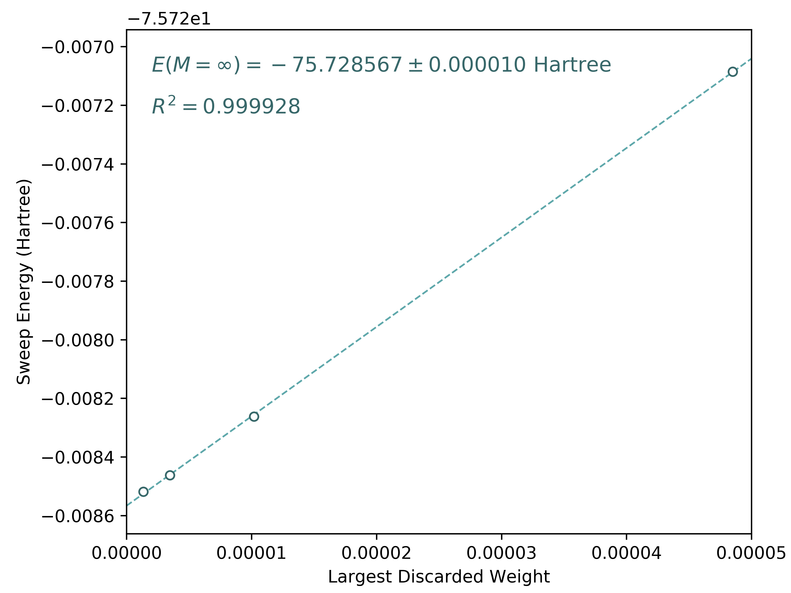

.. highlight:: bash

Basic Usage
===========

In this documentation, we explain how to use ``block2`` as an "executable".
The input parameters are provided in a formatted input file.
The input file format used in ``block2`` is highly compatible to the ``StackBlock`` format.
For the most cases, the ``StackBlock`` input/configuration file ("dmrg.conf") can be directly understood by ``block2``,
but ``block2`` also has some important extension for the keywords.

The information provided below is analogous to the corresponding ``StackBlock``
`documentation <https://sanshar.github.io/Block/examples.html>`_,
since the same input file format is used. However, the output format of ``block2``
can be very different from that of ``StackBlock``.

Preparation
-----------

If ``block2`` is installed using ``pip install block2``, one can run a DMRG calculation using the following command: ::

    block2main dmrg.conf > dmrg.out

Otherwise, for manual installation, please first compile the code according to
:ref:`user_installation` with ``cmake`` option ``-DBUILD_LIB=ON`` (and other necessary options).
The following python script is used as the "block2 executable": ::

    ${BLOCK2HOME}/pyblock2/driver/block2main

where ``${BLOCK2HOME}`` is the ``block2`` root directory. The ``build`` directory under ``block2``
root directory should be in ``PYTHONPATH``. You can add the following line in your environemnt
(such as ``~/.bashrc``) or submission script: ::

    export PYTHONPATH=${BLOCK2HOME}/build:${PYTHONPATH}

Then you can run a DMRG calculation using the following command: ::

    ${BLOCK2HOME}/pyblock2/driver/block2main dmrg.conf > dmrg.out

where ``dmrg.conf`` is the input file and ``dmrg.out`` is the output file.

To run a DMRG calculation with MPI parallelization, please use the following command: ::

    mpirun --bind-to core --map-by ppr:${SLURM_TASKS_PER_NODE}:node:pe=${OMP_NUM_THREADS} \
        python -u ${BLOCK2HOME}/pyblock2/driver/block2main dmrg.conf > dmrg.out

where ``${SLURM_TASKS_PER_NODE}`` is the number of mpi processes in each node.
``${OMP_NUM_THREADS}`` is the number of threads (CPU cores) used by each mpi process.
When executed in multiple nodes, a global scratch space (network file system) is required.

Integral Generation
-------------------

.. highlight:: python3

In the following we will use the C\ :sub:`2` molecule to demonstrate the ``block2`` features.
Integrals and orbitals should be supplied externally in the Molpro's FCIDUMP format.
The integral file for C\ :sub:`2` can be found in ``${BLOCK2HOME}/data/C2.CAS.PVDZ.FCIDUMP.ORIG`` or
generated using the following script (only the RHF case is required): ::

    from pyscf import gto, scf, mcscf
    from pyblock2._pyscf.ao2mo import integrals as itg
    from pyblock2.driver.core import DMRGDriver, SymmetryTypes

    mol = gto.M(atom='C 0 0 0; C 0 0 1.2425', basis='ccpvdz', symmetry='d2h')

    # RHF case (for spin-adapted / non-spin-adapted DMRG)
    mf = scf.RHF(mol).run()
    mc = mcscf.CASCI(mf, 26, 8)
    ncas, n_elec, spin, ecore, h1e, g2e, orb_sym = itg.get_rhf_integrals(mf, mc.ncore, mc.ncas, g2e_symm=8)
    driver = DMRGDriver(scratch="./tmp", symm_type=SymmetryTypes.SU2)
    driver.initialize_system(n_sites=ncas, n_elec=n_elec, spin=spin, orb_sym=orb_sym)
    driver.write_fcidump(h1e, g2e, ecore=ecore, filename='./FCIDUMP', pg="d2h", h1e_symm=True)

    # UHF case (for non-spin-adapted DMRG only)
    mf = scf.UHF(mol).run()
    mc = mcscf.UCASCI(mf, 26, 8)
    ncas, n_elec, spin, ecore, h1e, g2e, orb_sym = itg.get_uhf_integrals(mf, mc.ncore[0], mc.ncas, g2e_symm=8)
    driver = DMRGDriver(scratch="./tmp", symm_type=SymmetryTypes.SZ)
    driver.initialize_system(n_sites=ncas, n_elec=n_elec, spin=spin, orb_sym=orb_sym)
    driver.write_fcidump(h1e, g2e, ecore=ecore, filename='./FCIDUMP.UHF', pg="d2h", h1e_symm=True)

Alternatively, the integral file can be generated using the ``pyscf/dmrgscf`` interface: ::

    from pyscf import gto, scf, mcscf, dmrgscf
    import os

    dmrgscf.settings.BLOCKEXE = os.popen("which block2main").read().strip()
    dmrgscf.settings.MPIPREFIX = ''

    mol = gto.M(atom='C 0 0 0; C 0 0 1.2425', basis='ccpvdz', symmetry=1)
    mf = scf.RHF(mol).run()
    mc = mcscf.CASCI(mf, 26, 8)
    mc.fcisolver = dmrgscf.DMRGCI(mol)
    mc.canonicalization = False
    dmrgscf.dryrun(mc)

.. note ::

    Please see :ref:`user_dmrgscf` for the instruction for the installation of ``pyscf/dmrgscf``.

.. highlight:: bash

Ground State Energy
-------------------

The following input file can be used to compute the ground state energy: ::

    sym d2h
    orbitals C2.CAS.PVDZ.FCIDUMP.ORIG

    nelec 8
    spin 0
    irrep 1

    hf_occ integral
    schedule default
    maxM 500
    maxiter 30
    num_thrds 16

.. note ::

    Note that the integral file ``C2.CAS.PVDZ.FCIDUMP.ORIG`` should be in the working direcotry.
    By default, the orbitals will be reordered using the ``fiedler`` method. One can optionally
    add the keyword ``noreorder`` to avoid orbital reordering.

    ``num_thrds`` indicates the number of OpenMP threads (shared-memory parallelism) to use.

    ``hf_occ integral`` has no effects in ``block2``, but it is required in ``StackBlock``.
    If this line appear, ``block2main`` will try to write some output files in a stackblock-compatible format.

    By default, the calculation will be done in the spin-adapted mode, which is the most efficient.
    One can optionally add the keyword ``nonspinadapted`` to use the non-spin-adapted mode.

    The keyword ``prefix <scratch dir>`` can be used to set a folder for storing scratch files.
    If running in a HPC supercomputer, it is highly recommended to use the high IO speed scratch space
    (instead of the "home" storage) to achieve high performance.

    Lines start with ``!`` in the input file will be ignored. [#note1]_

D\ :sub:`2h` point group is enabled by ``sym d2h``.
The keywords ``schedule default`` and ``maxM`` sets the default sweep schedule and
the maximum number of renormalized states kept during the sweep, respectively.
``block2`` will then automatically set a sweep schedule as well as the defaults for various convergence thresholds.

The mps bond dimensions, sweep energies and the associated maximum discarded weights can be extracted by grepping the output ``dmrg.out``. ::

    $ grep Bond dmrg.out
    Sweep =    0 | Direction =  forward | Bond dimension =  250 | Noise =  1.00e-03 | Dav threshold =  1.00e-04
    Sweep =    1 | Direction = backward | Bond dimension =  250 | Noise =  1.00e-03 | Dav threshold =  1.00e-04
    Sweep =    2 | Direction =  forward | Bond dimension =  250 | Noise =  1.00e-03 | Dav threshold =  1.00e-04
    Sweep =    3 | Direction = backward | Bond dimension =  250 | Noise =  1.00e-03 | Dav threshold =  1.00e-04
    ... ...
    Sweep =   16 | Direction =  forward | Bond dimension =  500 | Noise =  0.00e+00 | Dav threshold =  1.00e-06
    Sweep =   17 | Direction = backward | Bond dimension =  500 | Noise =  0.00e+00 | Dav threshold =  1.00e-06
    Sweep =    0 | Direction =  forward | Bond dimension =  500 | Noise =  0.00e+00 | Dav threshold =  1.00e-06
    Sweep =    1 | Direction = backward | Bond dimension =  500 | Noise =  0.00e+00 | Dav threshold =  1.00e-06

    $ grep DW dmrg.out
    Time elapsed =      1.678 | E =     -75.4879935448 | DW = 1.39e-05
    Time elapsed =      2.936 | E =     -75.6007921322 | DE = -1.13e-01 | DW = 9.88e-06
    Time elapsed =      4.203 | E =     -75.6367659659 | DE = -3.60e-02 | DW = 9.25e-05
    Time elapsed =      5.750 | E =     -75.6373954252 | DE = -6.29e-04 | DW = 3.91e-05
    ... ...
    Time elapsed =     38.782 | E =     -75.7283521752 | DE = -3.48e-05 | DW = 5.24e-06
    Time elapsed =     41.169 | E =     -75.7283676788 | DE = -1.55e-05 | DW = 5.28e-06
    Time elapsed =      2.009 | E =     -75.7283421257 | DW = 4.18e-17
    Time elapsed =      4.158 | E =     -75.7283421257 | DE = -2.84e-14 | DW = 2.47e-16

Note that in the last two sweeps (in default schedule) the 1-site algorithm is used.
As a result, the discarded weights are nearly zero.

If you set ``outputlevel 1`` in the input file, only essential information will be
printed and the ``grep`` step can be skipped.

Targeting States
----------------

You can target the states distinguished by the number of electrons ``nelec``,
the total spin ``spin`` and the point-group symmetry of the state ``irrep``.

The following input file computes the energy for a single B\ :sub:`1g` state in D\ :sub:`2h` point group: ::

    sym d2h
    orbitals C2.CAS.PVDZ.FCIDUMP.ORIG

    nelec 8
    spin 0
    irrep 4

    hf_occ integral
    schedule default
    maxM 500
    maxiter 30

.. note ::

    In D\ :sub:`2h` point group, ``irrep`` can be A\ :sub:`1g` (1), B\ :sub:`3u` (2),
    B\ :sub:`2u` (3), B\ :sub:`1g` (4), B\ :sub:`1u` (5), B\ :sub:`2g` (6), B\ :sub:`3g` (7), A\ :sub:`1u` (8).

This will generate the following output: ::

    $ grep DW dmrg.out
    Time elapsed =      1.983 | E =     -75.5422510106 | DW = 1.08e-05
    Time elapsed =      3.580 | E =     -75.6245880097 | DE = -8.23e-02 | DW = 9.97e-06
    Time elapsed =      5.376 | E =     -75.6366528654 | DE = -1.21e-02 | DW = 9.13e-05
    Time elapsed =      7.172 | E =     -75.6374064699 | DE = -7.54e-04 | DW = 4.03e-05
    ... ...
    Time elapsed =     38.611 | E =     -75.6389586629 | DE = -2.48e-05 | DW = 2.01e-06
    Time elapsed =     40.981 | E =     -75.6389699555 | DE = -1.13e-05 | DW = 2.05e-06
    Time elapsed =      2.029 | E =     -75.6389630224 | DW = 5.58e-15
    Time elapsed =      4.106 | E =     -75.6389632670 | DE = -2.45e-07 | DW = 2.40e-16

State-Averaged Calculation
--------------------------

In the state-averaged DMRG algorithm, more than one state can be targeted in one calculation.
The states being calculated can have the same or different ``nelec``, ``spin`` or ``irrep``.
Multiple values can be given for the above keywords. [#note1]_
The number of states (roots) and the weight of each state can be specified using keywords
``nroots`` and ``weights``, respectively.
``block2`` will then try to find the low energy states within the space of targets formed
by all combintaions of the given values of ``nelec``, ``spin`` and ``irrep``.

.. note ::

    In ``StackBlock``, state-averaged calculation can only be done for states with the same
    ``nelec``, ``spin`` and ``irrep``. In ``block2``, targetting multiple ``nelec``, ``spin`` or ``irrep``
    may cause the calculation hard to converge to the lowest energy states. Typically,
    one needs larger ``nroots`` than the number of states actually needed, to make sure that
    the low energy states are converged.

    For normal non-state-averaged calculation, namely, when ``nroots`` is 1, you can also target
    multiple ``nelec``, ``spin`` or ``irrep``.

The following input file performs state-averged DMRG for two A\ :sub:`1g` states in D\ :sub:`2h` point group: ::

    sym d2h
    orbitals C2.CAS.PVDZ.FCIDUMP.ORIG

    nelec 8
    spin 0
    irrep 1
    nroots 2
    weights 0.5 0.5

    hf_occ integral
    schedule default
    maxM 500
    maxiter 30

This will generate the following output: ::

    $ grep DW dmrg.out
    Time elapsed =      3.257 | E[  2] =     -75.5019604920    -75.4800275143 | DW = 1.54e-05
    Time elapsed =      5.109 | E[  2] =     -75.5980474127    -75.5776457885 | DE = -9.76e-02 | DW = 1.98e-05
    Time elapsed =      6.854 | E[  2] =     -75.6711500018    -75.6363593637 | DE = -5.87e-02 | DW = 1.86e-04
    Time elapsed =      8.635 | E[  2] =     -75.6717525884    -75.6368970346 | DE = -5.38e-04 | DW = 1.35e-04
    Time elapsed =     45.946 | E[  2] =     -75.7279558636    -75.6386525742 | DE = -3.41e-05 | DW = 2.49e-05
    Time elapsed =     48.491 | E[  2] =     -75.7279954715    -75.6386699048 | DE = -1.73e-05 | DW = 1.67e-05
    Time elapsed =      2.215 | E[  2] =     -75.7279403993    -75.6386251036 | DW = 1.77e-05
    Time elapsed =      4.338 | E[  2] =     -75.7279224367    -75.6386152528 | DE = 9.85e-06 | DW = 8.35e-06

State-Specific Calculation
--------------------------

Orthogonalization Approach
^^^^^^^^^^^^^^^^^^^^^^^^^^

The state-specific calculation can be done as a restart calculation which assumes that a previous
state-averaged DMRG calculation has been converged. The state-specific DMRG calculation then reads the MPS
from scratch folder and refines them for each root separately.
The state-specific DMRG calculation can be done with any of ``onedot``, ``twodot`` or ``twodot_to_onedot`` (default)
keywords. [#note1]_

.. note ::

    In ``StackBlock``, state-specific calculation can only be done with ``onedot``.

A state-specific DMRG calculation for two A\ :sub:`1g` states in D\ :sub:`2h` point group consists of two steps.

* First, using the input file given in the previous section to obtain the state-averaged MPSs (in the scratch folder).
* Second, the state-specific DMRG calculation can be performed by setting the keyword ``statespecific``.
  The MPSs from the previous DMRG calculation will be read from the scratch folder. The following input file can be used
  for this step: ::

    sym d2h
    orbitals C2.CAS.PVDZ.FCIDUMP.ORIG

    nelec 8
    spin 0
    irrep 1
    nroots 2
    weights 0.5 0.5
    statespecific

    hf_occ integral
    schedule default
    maxM 500
    maxiter 30

This will generate the following output: ::

    $ grep Energy dmrg.out
    DMRG Energy for root    0 =  -75.728342642601376
    DMRG Energy for root    1 =  -75.638959372610813

Sometimes, the orthogonalization approach can be unstable and when computing the exciated state
it may fall back to the ground state. Adding the keyword ``onedot`` for the second step can alleviate this problem.

Level Shift Approach
^^^^^^^^^^^^^^^^^^^^

The second step of the above can also be done with the level shift approach,
by changing Hamiltonian from :math:`\hat{H}` to :math:`\hat{H} + \sum_i w_i |\phi_i\rangle \langle \phi_i|`.
Normally, the weights :math:`w_i` are positive and they should be larger than the energy gap.

The following input file can be used for the second step: ::

    sym d2h
    orbitals C2.CAS.PVDZ.FCIDUMP.ORIG

    nelec 8
    spin 0
    irrep 1
    nroots 2
    weights 0.5 0.5
    statespecific
    proj_weights 5 5

    hf_occ integral
    schedule default
    maxM 500
    maxiter 30

This will generate the following output: ::

    $ grep Energy dmrg.out
    DMRG Energy for root    0 =  -75.728341047222145
    DMRG Energy for root    1 =  -75.638958637510370

Without State-Average
^^^^^^^^^^^^^^^^^^^^^

The excited MPS and energies can also be obtained without performing a state-averaged calculation as the first step.
Instead, we can do several DMRG, and each time projecting out MPSs from all previous DMRG.

.. note ::

    It is recommended to use ``noreorder`` or fixed manual orbital reordering for this approach.
    Otherwise, one should carefully check that the orbital reordering in all DMRG calculations are the same.

We first get the ground state using the following input file ``dmrg-1.conf``: ::

    sym d2h
    orbitals C2.CAS.PVDZ.FCIDUMP.ORIG

    nelec 8
    spin 0
    irrep 1

    schedule default
    maxM 500
    maxiter 30
    mps_tags KET1

After this is finished, we compute the first excited state using the following input file ``dmrg-2.conf``: ::
    
    sym d2h
    orbitals C2.CAS.PVDZ.FCIDUMP.ORIG

    nelec 8
    spin 0
    irrep 1

    schedule default
    maxM 500
    maxiter 30
    mps_tags KET2

    proj_mps_tags KET1
    proj_weights 5

Then we compute the second excited state using the following input file ``dmrg-3.conf``: ::

    sym d2h
    orbitals C2.CAS.PVDZ.FCIDUMP.ORIG

    nelec 8
    spin 0
    irrep 1

    schedule default
    maxM 500
    maxiter 30
    mps_tags KET3

    proj_mps_tags KET1 KET2
    proj_weights 5 5

And so on.

This will generate the following output: ::

    $ grep Energy dmrg-*.out
    dmrg-1.out:DMRG Energy =  -75.728342508616663
    dmrg-2.out:DMRG Energy =  -75.638961566176221
    dmrg-3.out:DMRG Energy =  -75.629597871820607
    dmrg-4.out:DMRG Energy =  -75.467766576734363
    dmrg-5.out:DMRG Energy =  -75.350470798772307
    dmrg-6.out:DMRG Energy =  -75.312672909521751

Mixed with State-Average
^^^^^^^^^^^^^^^^^^^^^^^^

The above approach can also be used together with the state-average approach. Namely, we can first compute the two lowest
states, then we compute the next three lowest states, by projecting out the two lowest states.
The MPS to be projected must not be in state-averaged format, so we need to use the ``split_states`` keyword to break
state-averaged MPS into individual MPSs, so that they can be used for projection in the subsequent calculations.

Currently, this type of state-average calulcation cannot be used together with multiple targets.

We first get the two lowest states using the following input file ``dmrg-1.conf``: ::

    sym d2h
    orbitals C2.CAS.PVDZ.FCIDUMP.ORIG

    nelec 8
    spin 0
    irrep 1
    nroots 2
    weights 0.5 0.5

    schedule default
    maxM 500
    maxiter 30
    mps_tags KET

    copy_mps
    split_states

After this is finished, we compute the next three states using the following input file ``dmrg-2.conf``: ::

    sym d2h
    orbitals C2.CAS.PVDZ.FCIDUMP.ORIG

    nelec 8
    spin 0
    irrep 1
    nroots 3
    weights 0.5 0.5 0.5

    schedule default
    maxM 500
    maxiter 30
    mps_tags EXKET

    proj_mps_tags KET-0 KET-1
    proj_weights 5 5

    copy_mps
    split_states

After this is finished, we compute the next one state using the following input file ``dmrg-3.conf``: ::

    sym d2h
    orbitals C2.CAS.PVDZ.FCIDUMP.ORIG

    nelec 8
    spin 0
    irrep 1

    schedule default
    maxM 500
    maxiter 30
    mps_tags EXXKET

    proj_mps_tags KET-0 KET-1 EXKET-0 EXKET-1 EXKET-2
    proj_weights 5 5 5 5 5

This will generate the following output: ::

    $ grep DW dmrg-1.out | tail -1
    Time elapsed =      5.461 | E[  2] =     -75.7279224622    -75.6386156808 | DE = 9.32e-06 | DW = 8.33e-06
    $ grep DW dmrg-2.out | tail -1
    Time elapsed =     13.165 | E[  3] =     -75.6290377907    -75.4669665917    -75.3494878435 | DE = 8.63e-07 | DW = 8.45e-05
    $ grep DW dmrg-3.out | tail -1
    Time elapsed =      8.651 | E =     -75.3126745298 | DE = -6.24e-07 | DW = 3.79e-15

n-Particle Reduced Density Matrix
---------------------------------

The 1-, 2-, 3-, and 4-particle DMRG reduced density matrix for a particular state can be calculated using
the keywords ``onepdm``, ``twopdm``, ``threepdm`` and ``fourpdm``.
The reduced density matrix calculation can be done with either ``onedot`` or ``twodot`` keywords. [#note1]_

.. note ::

    Most of the time, only ``onedot`` density matrix calculation makes sense, since the MPS should not change
    during the sweep.

Density matrices of the :math:`n`-th state are calculated and stored in a ``numpy`` binary file
named ``1pdm-n-n.npy``, ``2pdm-n-n.npy``, ``3pdm-n-n.npy``, etc. (in the scratch folder), respectively,
starting with ``n = 0``.
If there is only one root, the files are named ``1pdm.npy``, ``2pdm.npy``, ``3pdm.npy``, etc. respectively.

The following input file computes the energy and 2-particle density matrix for the ground state: ::

    sym d2h
    orbitals C2.CAS.PVDZ.FCIDUMP.ORIG

    nelec 8
    spin 0
    irrep 1

    schedule default
    maxM 500
    maxiter 30

    twopdm
    num_thrds 16
    
.. highlight:: python3

The 2-particle density matrix file can be loaded using the following python script: ::

    >>> import numpy as np
    >>> _2pdm = np.load('./nodex/2pdm.npy')
    >>> print(_2pdm.shape)
    (3, 26, 26, 26, 26)

.. highlight:: bash

The following input file computes the energy and 2-particle density matrix for two
state-averaged A\ :sub:`1g` states: ::

    sym d2h
    orbitals C2.CAS.PVDZ.FCIDUMP.ORIG

    nelec 8
    spin 0
    irrep 1
    nroots 2
    weights 0.5 0.5

    schedule default
    maxM 500
    maxiter 30

    twopdm
    num_thrds 16
    
.. highlight:: python3

The 2-particle density matrix file for the first state can be loaded using the following python script: ::

    >>> import numpy as np
    >>> n = 0
    >>> _2pdm = np.load('./nodex/2pdm-%d-%d.npy' % (n, n))
    >>> print(_2pdm.shape)
    (3, 26, 26, 26, 26)

The 1-particle density matrix (in both the non-spin-adapted and spin-adapted mode) is stored as an array with the shape :math:`[2,n,n]`,
where ``n`` is the number of spatial orbitals, and the two components with indicies :math:`[:,a,b]` are for
:math:`\langle a^\dagger_{a\alpha} a_{b\alpha} \rangle`, and :math:`\langle a^\dagger_{a\beta} a_{b\beta} \rangle`,
respectively.

The 2-particle density matrix (in both the non-spin-adapted and spin-adapted mode) is stored as an array with the shape :math:`[3,n,n,n,n]`,
where the three components with indicies :math:`[:,a,b,c,d]` are for
:math:`\langle a^\dagger_{a\alpha} a^\dagger_{b\alpha} a_{c\alpha} a_{d\alpha} \rangle`,
:math:`\langle a^\dagger_{a\alpha} a^\dagger_{b\beta} a_{c\beta} a_{d\alpha} \rangle`,
and :math:`\langle a^\dagger_{a\beta} a^\dagger_{b\beta} a_{c\beta} a_{d\beta} \rangle`,
respectively.

The 3-particle density matrix in the spin-adapted mode is stored as the spin-traced format
with the shape :math:`[n,n,n,n,n,n]`, defined as

.. math::

    \text{3pdm}[a, b, c, d, e, f] := \sum_{\sigma\tau\lambda}
        a^\dagger_{a\sigma} a^\dagger_{b\tau} a^\dagger_{c\lambda} a_{d\lambda} a_{e\tau} a_{f\sigma}

The 3-particle density matrix in the non-spin-adapted mode is stored as an array with the shape :math:`[4,n,n,n,n,n,n]`,
where the four components with indicies :math:`[:,a,b,c,d,e,f]` are for
:math:`\langle a^\dagger_{a\alpha} a^\dagger_{b\alpha} a^\dagger_{c\alpha} a_{d\alpha}a_{e\alpha} a_{f\alpha} \rangle`,
:math:`\langle a^\dagger_{a\alpha} a^\dagger_{b\alpha} a^\dagger_{c\beta} a_{d\beta}a_{e\alpha} a_{f\alpha} \rangle`,
:math:`\langle a^\dagger_{a\alpha} a^\dagger_{b\beta} a^\dagger_{c\beta} a_{d\beta}a_{e\beta} a_{f\alpha} \rangle`,
and :math:`\langle a^\dagger_{a\beta} a^\dagger_{b\beta} a^\dagger_{c\beta} a_{d\beta}a_{e\beta} a_{f\beta} \rangle`,
respectively.

The 4-particle density matrix in the spin-adapted mode is stored as the spin-traced format
with the shape :math:`[n,n,n,n,n,n,n,n]`, defined as

.. math::

    \text{4pdm}[a, b, c, d, e, f, g, h] := \sum_{\sigma\tau\lambda\mu}
        a^\dagger_{a\sigma} a^\dagger_{b\tau} a^\dagger_{c\lambda} a^\dagger_{d\mu} a_{e\mu}a_{f\lambda} a_{g\tau} a_{h\sigma}

The 4-particle density matrix in the non-spin-adapted mode is stored as an array with the shape :math:`[5,n,n,n,n,n,n,n,n]`,
where the five components with indicies :math:`[:,a,b,c,d,e,f,g,h]` are for
:math:`\langle a^\dagger_{a\alpha} a^\dagger_{b\alpha} a^\dagger_{c\alpha} a^\dagger_{d\alpha} a_{e\alpha} a_{f\alpha} a_{g\alpha} a_{h\alpha} \rangle`,
:math:`\langle a^\dagger_{a\alpha} a^\dagger_{b\alpha} a^\dagger_{c\alpha} a^\dagger_{d\beta} a_{e\beta} a_{f\alpha} a_{g\alpha} a_{h\alpha} \rangle`,
:math:`\langle a^\dagger_{a\alpha} a^\dagger_{b\alpha} a^\dagger_{c\beta} a^\dagger_{d\beta} a_{e\beta} a_{f\beta} a_{g\alpha} a_{h\alpha} \rangle`,
:math:`\langle a^\dagger_{a\alpha} a^\dagger_{b\beta} a^\dagger_{c\beta} a^\dagger_{d\beta} a_{e\beta} a_{f\beta} a_{g\beta} a_{h\alpha} \rangle`,
and :math:`\langle a^\dagger_{a\beta} a^\dagger_{b\beta} a^\dagger_{c\beta} a^\dagger_{d\beta} a_{e\beta} a_{f\beta} a_{g\beta} a_{h\beta} \rangle`,
respectively.

In the general spin orbital mode (with the keyword ``use_general_spin``), the 1-, 2-, 3-, and 4-particle density matrices are stored
with the shape :math:`[1,n,n]`, :math:`[1,n,n,n,n]`, :math:`[1,n,n,n,n,n,n]`, and :math:`[1,n,n,n,n,n,n,n,n]` respectively,
where ``n`` is the number of spin orbitals. The content is the expectation value for :math:`\langle a^\dagger_{a} a_{b} \rangle`,
:math:`\langle a^\dagger_{a} a^\dagger_{b} a_{c} a_{d} \rangle`, :math:`\langle a^\dagger_{a} a^\dagger_{b} a^\dagger_{c} a_{d} a_{e} a_{f} \rangle`,
and :math:`\langle a^\dagger_{a} a^\dagger_{b} a^\dagger_{c} a^\dagger_{d} a_{e} a_{f} a_{g} a_{h} \rangle`, respectively.

.. highlight:: bash

n-Particle Transition Reduced Density Matrix
--------------------------------------------

The 1-, 2-, 3- and 4-particle DMRG transition density matrix can be calculated using
the keywords ``tran_onepdm``, ``tran_twopdm``, ``tran_threepdm`` and ``tran_fourpdm``.

Transition density matrices between the :math:`m`-th (bra) and :math:`n`-th (ket) states are calculated and stored in a ``numpy`` binary file
named ``1pdm-m-n.npy``, ``2pdm-m-n.npy``, etc. (in the scratch folder), respectively, starting with ``m = n = 0``.

The following input file computes the 2-particle transition density matrix for two
state-averaged A\ :sub:`1g` states: ::

    sym d2h
    orbitals C2.CAS.PVDZ.FCIDUMP.ORIG

    nelec 8
    spin 0
    irrep 1
    nroots 2
    weights 0.5 0.5

    schedule default
    maxM 500
    maxiter 30

    tran_twopdm
    num_thrds 16

.. note ::

    There can be a overall undetermined +1/-1 factor in Transition density matrices due to the relative phase in two MPSs.

The following input file computes the state-specific 2-particle transition density matrix for two
refined A\ :sub:`1g` states: ::

    sym d2h
    orbitals C2.CAS.PVDZ.FCIDUMP.ORIG

    nelec 8
    spin 0
    irrep 1
    nroots 2
    weights 0.5 0.5
    statespecific

    schedule default
    maxM 500
    maxiter 30

    tran_twopdm
    num_thrds 16

The transition density matrices between states with different point group irreducible representations are also available by simply
adding the keyword ``tran_twopdm`` after the corresponding multi-target state-averaged calculation. [#note1]_

Restart DMRG Energy Calculation
-------------------------------

DMRG energy calculations can be restarted, using the MPS (stored in scratch folder) generated in the previous calculation,
by specifying the keyword ``fullrestart``.
If the previous calulcation stopped during the middle of a sweep, it will be restarted from the middle of a sweep.

Alternatively, the user can also set a directory for storing MPS after each sweep using the keyword ``restart_dir``. [#note1]_
When restarting, the MPS data and ``mps_info.bin`` in the scratch folder should be copied from the ``restart_dir`` to the
scartch folder of the restarting calculation.

The keyword ``restart_dir_per_sweep`` can be used to save a copy of MPS for each sweep. The MPS from different sweeps will
be put into different folders (by adding suffix to the given direcotry).

You may need to change the (custom) scheudle in the input file so that the sweeps (with smaller bond dimension) finished in previous
calculations will not be repeated, when you are restarting an interrupted calculation.

The following input file restarts an interrupted calculation: ::

    sym d2h
    orbitals C2.CAS.PVDZ.FCIDUMP.ORIG

    nelec 8
    spin 0
    irrep 1

    hf_occ integral
    schedule default
    maxM 500
    maxiter 30

    fullrestart

Load MPS for Density Matrix Calculation
---------------------------------------

The density matrix and transition density matrix calculation can be carried out separately, by
restarting from an existing MPS, state-averged MPSs or state-specific MPSs (stored in scartch folder
from a previous DMRG energy calculation).

Assuming a previous ground-state energy calculation has been finished, 
the following input file computes the 2-particle density matrix for the ground-state (loaded from scratch folder): ::

    sym d2h
    orbitals C2.CAS.PVDZ.FCIDUMP.ORIG

    nelec 8
    spin 0
    irrep 1

    hf_occ integral
    schedule default
    maxM 500
    maxiter 30

    restart_twopdm

Assuming a previous state-averaged energy calculation has been finished, 
the following input file computes the 2-particle transition density matrix for two
state-averaged A\ :sub:`1g` states (loaded from scratch folder): ::

    sym d2h
    orbitals C2.CAS.PVDZ.FCIDUMP.ORIG

    nelec 8
    spin 0
    irrep 1
    nroots 2
    weights 0.5 0.5

    hf_occ integral
    schedule default
    maxM 500
    maxiter 30

    restart_tran_twopdm

Now we explain how to compute 2-particle transition density matrix for bra and ket states
belonging to different point group irreducible representations.
We consider the A\ :sub:`1g` (bra) and B\ :sub:`3u` (ket) states.

The following input file computes the energy for a single B\ :sub:`3u` state in D\ :sub:`2h` point group.
The keyword ``mps_tags`` can be used to assign a tag to the mps for later reference: [#note1]_ ::

    sym d2h
    orbitals C2.CAS.PVDZ.FCIDUMP.ORIG

    nelec 8
    spin 0
    irrep 2

    hf_occ integral
    schedule default
    maxM 500
    maxiter 30

    mps_tags KET

The following input file computes the energy for a single A\ :sub:`1g` state in D\ :sub:`2h` point group: ::

    sym d2h
    orbitals C2.CAS.PVDZ.FCIDUMP.ORIG

    nelec 8
    spin 0
    irrep 1

    hf_occ integral
    schedule default
    maxM 500
    maxiter 30

    mps_tags BRA

The output looks like the following: ::

    $ grep Energy dmrg-1.out
    DMRG Energy =  -75.675393353797631
    $ grep Energy dmrg-2.out
    DMRG Energy =  -75.728342388135175

The following input file computes the 2-particle transition density matrix for the two states: ::

    sym d2h
    orbitals C2.CAS.PVDZ.FCIDUMP.ORIG

    nelec 8
    spin 0
    irrep 1
    mps_tags BRA KET

    hf_occ integral
    schedule default
    maxM 500
    maxiter 30
    restart_tran_twopdm

Note that in the above input file, keywords such as ``nelec``, ``spin``, ``irrep``, and ``nroots`` will be unimportant.
The keyword ``mps_tags`` lists the tags for the MPSs that should be loaded. [#note1]_

Diagonal 2-Particle Density Matrix
----------------------------------

Since the full two-particle density matrix calculation can be expensive for some systems,
it is possible to calculate only the diagonal parts, which is much cheaper, using the keywords
``restart_diag_twopdm`` or ``diag_twopdm``. [#note1]_
The time cost for diagonal 2pdm is roughly 2 times of the cost of 1pdm.

Note that ``diag_twopdm`` implies ``onepdm`` and ``correlation``. The diagonal 2pdm is defined as:

.. math::
    e_{pqqp} \equiv&\ \sum_{\sigma\tau} \langle a_{p\sigma}^\dagger a_{q\tau}^\dagger a_{q\tau} a_{p\sigma} \rangle
        = -\sum_{\sigma\tau} \langle a_{p\sigma}^\dagger a_{q\tau}^\dagger a_{p\sigma} a_{q\tau} \rangle
        = \sum_{\sigma\tau} \langle a_{p\sigma}^\dagger a_{p\sigma} a_{q\tau}^\dagger a_{q\tau} \rangle
            - \delta_{pq} \sum_{\sigma} \langle a_{p\sigma}^\dagger a_{q\sigma} \rangle \\
        =&\ \sum_{\sigma\tau} \langle n_{p\sigma} n_{q\tau} \rangle
            - \delta_{pq} \sum_{\sigma} \langle a_{p\sigma}^\dagger a_{q\sigma} \rangle \\
    e_{pqpq} \equiv&\ \sum_{\sigma\tau} \langle a_{p\sigma}^\dagger a_{q\tau}^\dagger a_{p\tau} a_{q\sigma} \rangle
        = -\sum_{\sigma\tau} \langle a_{p\sigma}^\dagger a_{p\tau} a_{q\tau}^\dagger a_{q\sigma} \rangle
            + \delta_{pq} \sum_{\sigma\tau} \langle a_{p\sigma}^\dagger a_{q\sigma} \rangle \\
        =&\ -\sum_{\sigma\tau} \langle a_{p\sigma}^\dagger a_{p\tau} a_{q\tau}^\dagger a_{q\sigma} \rangle
            + 2\delta_{pq} \sum_{\sigma} \langle a_{p\sigma}^\dagger a_{q\sigma} \rangle

The computed diagonal 2pdm will be stored as ``e_pqqp.npy`` and ``e_pqpq.npy`` in scratch folder.

If one also computed the full 2pdm using the keyword ``twopdm`` or ``restart_twopdm``,
we can verify that its diagonal part matches the ``e_pqqp.npy`` and ``e_pqpq.npy`` obtained here: ::

    >>> import numpy as np
    >>> _2pdm = np.load('./nodex/2pdm.npy')
    >>> print(_2pdm.shape)
    (3, 26, 26, 26, 26)
    >>> _e_pqqp = np.load('./nodex/e_pqqp.npy')
    >>> _e_pqpq = np.load('./nodex/e_pqpq.npy')
    >>> _2pdm_spat = _2pdm[0] + 2 * _2pdm[1] + _2pdm[2]
    >>> _2pdm_spat_pqqp = np.einsum('pqqp->pq', _2pdm_spat)
    >>> _2pdm_spat_pqpq = np.einsum('pqpq->pq', _2pdm_spat)
    >>> print(np.linalg.norm(_e_pqqp - _2pdm_spat_pqqp))
    3.28666776770176e-14
    >>> print(np.linalg.norm(_e_pqpq - _2pdm_spat_pqpq))
    1.6947732597975102e-14

Custom Sweep Schedule
---------------------

The sweep schedule defines number of the renormalized states :math:`M` kept ,
the convergence threshold for Davidson algorithm (in the unit of norm\ :sup:`2`), and the noise
(in the unit of norm\ :sup:`2`) in successive DMRG sweeps.
For finer control over the sweeps, customized sweep schedule should be used.

The following input file computes the ground state energy using a custom sweep schedule: ::

    sym d2h
    orbitals C2.CAS.PVDZ.FCIDUMP.ORIG

    nelec 8
    spin 0
    irrep 1

    hf_occ integral
    schedule
    0  100  1E-4  1E-3
    4  250  1E-4  1E-3
    8  400  1E-5  1E-4
    10 600  1E-6  1E-5
    12 800  1E-7  1E-6
    14 1000 1E-8  1E-7
    16 1000 1E-8  0E+0
    end
    twodot_to_onedot 18
    maxiter 100
    sweep_tol 1E-9

In the above input file, ``twodot_to_onedot`` specifies the sweep at which the switch is made from
a 2-site to a 1-site DMRG algorithm (counting from 0). ``maxiter`` gives the maximum number of sweep
iterations to be performed. ``sweep_tol`` gives the final tolerance on the DMRG energy, and is analogous
to an energy convergence threshold in other quantum chemistry methods.

In the above input file, between ``schedule`` and ``end`` each line has four values. They are corresponding
to starting sweep iteration (counting from zero), MPS bond dimension, tolerance for the Davidson iteration,
and noise, respectively. Starting sweep iteration is the sweep iteration in which the given parameters
in the line should take effect.

This will generate the following output: ::

    $ grep DW dmrg.out
    Time elapsed =      1.686 | E =     -74.1599100997 | DW = 4.86e-05
    Time elapsed =      3.332 | E =     -74.6555553068 | DE = -4.96e-01 | DW = 7.28e-05
    Time elapsed =      4.461 | E =     -75.6224601188 | DE = -9.67e-01 | DW = 1.55e-04
    Time elapsed =      5.648 | E =     -75.6302268887 | DE = -7.77e-03 | DW = 1.26e-04
    Time elapsed =      7.491 | E =     -75.6347292246 | DE = -4.50e-03 | DW = 6.46e-05
    Time elapsed =     10.732 | E =     -75.6367873793 | DE = -2.06e-03 | DW = 2.96e-05
    Time elapsed =     13.383 | E =     -75.6372588510 | DE = -4.71e-04 | DW = 1.01e-04
    Time elapsed =     16.138 | E =     -75.6375874124 | DE = -3.29e-04 | DW = 3.83e-05
    Time elapsed =     20.541 | E =     -75.6687725683 | DE = -3.12e-02 | DW = 8.76e-06
    Time elapsed =     26.404 | E =     -75.7265879915 | DE = -5.78e-02 | DW = 9.21e-06
    Time elapsed =     36.001 | E =     -75.7282887562 | DE = -1.70e-03 | DW = 3.43e-06
    Time elapsed =     47.351 | E =     -75.7283943399 | DE = -1.06e-04 | DW = 3.04e-06
    Time elapsed =     64.673 | E =     -75.7284858001 | DE = -9.15e-05 | DW = 1.24e-06
    Time elapsed =     86.412 | E =     -75.7285031554 | DE = -1.74e-05 | DW = 1.21e-06
    Time elapsed =    118.443 | E =     -75.7285302492 | DE = -2.71e-05 | DW = 4.82e-07
    Time elapsed =    158.894 | E =     -75.7285335786 | DE = -3.33e-06 | DW = 5.44e-07
    Time elapsed =    176.071 | E =     -75.7285376489 | DE = -4.07e-06 | DW = 5.73e-07
    Time elapsed =    191.672 | E =     -75.7285377336 | DE = -8.46e-08 | DW = 5.76e-07
    Time elapsed =     10.790 | E =     -75.7285342605 | DW = 1.47e-16
    Time elapsed =     21.186 | E =     -75.7285342992 | DE = -3.87e-08 | DW = 3.21e-14
    Time elapsed =     31.924 | E =     -75.7285343224 | DE = -2.32e-08 | DW = 3.07e-17
    Time elapsed =     42.348 | E =     -75.7285343375 | DE = -1.51e-08 | DW = 8.17e-15
    Time elapsed =     53.073 | E =     -75.7285343475 | DE = -9.98e-09 | DW = 4.35e-17
    Time elapsed =     63.362 | E =     -75.7285343571 | DE = -9.58e-09 | DW = 6.64e-16
    Time elapsed =     73.965 | E =     -75.7285343630 | DE = -5.87e-09 | DW = 3.96e-17
    Time elapsed =     84.094 | E =     -75.7285343661 | DE = -3.17e-09 | DW = 1.14e-16
    Time elapsed =     94.525 | E =     -75.7285343678 | DE = -1.71e-09 | DW = 1.34e-16
    Time elapsed =    104.658 | E =     -75.7285343721 | DE = -4.29e-09 | DW = 2.45e-16
    Time elapsed =    114.925 | E =     -75.7285343746 | DE = -2.44e-09 | DW = 1.38e-16
    Time elapsed =    124.710 | E =     -75.7285343763 | DE = -1.76e-09 | DW = 3.03e-16
    Time elapsed =    135.115 | E =     -75.7285343763 | DE = 5.68e-14 | DW = 2.24e-17

Sweep Energy Extrapolation
--------------------------

In practice the sweep energy converges almost linearly as a function of the "maximum discarded weight".
Therefore, it is convenient to use the "maximum discarded weight" quantity as an estimate of the error
of the DMRG calculation. It is recommended to use the 2-site algorithm for energy extrapolation since
the 2-site DMRG wavefunction provides additional variational freedom over the 1-site DMRG wavefunction.
A strong deviation from a linear function (e.g. a plateau behavior followed by a sudden drop of the energy
as a function of discarded weight) indicates that the DMRG was stuck in a local minimum.

One can use restart a converged DMRG calculation with a "reverse schedule" to generate data for
energy extrapolation. This can guarentee that the energy for each different MPS bond dimension is fully
converged and not representing any local minima.

The following input file restarts the previous calculation using a custom reverse sweep schedule: ::

    sym d2h
    orbitals C2.CAS.PVDZ.FCIDUMP.ORIG

    nelec 8
    spin 0
    irrep 1

    hf_occ integral
    twodot
    schedule
    0  800  1E-8  0E+0
    4  600  1E-8  0E+0
    8  400  1E-8  0E+0
    12 200  1E-8  0E+0
    end
    maxiter 16
    sweep_tol 0.0
    fullrestart

This will generate the following output (``dmrg-2.out``): ::

    $ grep DW dmrg-2.out
    Time elapsed =     12.597 | E =     -75.7285358881 | DW = 1.75e-06
    Time elapsed =     23.720 | E =     -75.7285188420 | DE = 1.70e-05 | DW = 1.42e-06
    Time elapsed =     33.955 | E =     -75.7285186195 | DE = 2.23e-07 | DW = 1.35e-06
    Time elapsed =     44.842 | E =     -75.7285186529 | DE = -3.34e-08 | DW = 1.34e-06
    Time elapsed =     52.432 | E =     -75.7285113908 | DE = 7.26e-06 | DW = 4.98e-06
    Time elapsed =     59.530 | E =     -75.7284626837 | DE = 4.87e-05 | DW = 3.66e-06
    Time elapsed =     66.036 | E =     -75.7284622858 | DE = 3.98e-07 | DW = 3.49e-06
    Time elapsed =     73.045 | E =     -75.7284623697 | DE = -8.39e-08 | DW = 3.47e-06
    Time elapsed =     77.523 | E =     -75.7284421278 | DE = 2.02e-05 | DW = 1.71e-05
    Time elapsed =     81.396 | E =     -75.7282631341 | DE = 1.79e-04 | DW = 1.11e-05
    Time elapsed =     85.001 | E =     -75.7282618298 | DE = 1.30e-06 | DW = 1.02e-05
    Time elapsed =     88.824 | E =     -75.7282620286 | DE = -1.99e-07 | DW = 1.02e-05
    Time elapsed =     91.267 | E =     -75.7282077342 | DE = 5.43e-05 | DW = 1.04e-04
    Time elapsed =     93.148 | E =     -75.7270840401 | DE = 1.12e-03 | DW = 5.65e-05
    Time elapsed =     95.144 | E =     -75.7270844505 | DE = -4.10e-07 | DW = 5.01e-05
    Time elapsed =     96.921 | E =     -75.7270854757 | DE = -1.03e-06 | DW = 4.85e-05

.. highlight:: python3

Sweep energy extrapolation can be plotted using the following python script: ::

    import matplotlib.pyplot as plt
    import numpy as np
    import scipy.stats

    fname = 'dmrg-2.out'
    out = open(fname, 'r').readlines()
    eners, dws = [], []
    for l in out:
        if "DW" in l:
            eners.append(float(l.split()[7]))
            dws.append(float(l.split()[-1]))

    eners, dws = eners[3::4], dws[3::4]
    reg = scipy.stats.linregress(dws, eners)
    x_reg = np.array([0, 1E-4])

    emin, emax = min(eners), max(eners)
    de = emax - emin
    plt.plot(x_reg, reg.intercept + reg.slope * x_reg, '--', linewidth=1, color='#5FA8AB')
    plt.plot(dws, eners, 'o', color='#38686A', markerfacecolor='white', markersize=5)
    plt.text(2E-6, emax, "$E(M=\\infty) = %.6f \pm %.6f \\mathrm{\\ Hartree}$" %
        (reg.intercept, abs(reg.intercept - emin) / 5), color='#38686A', fontsize=12)
    plt.text(2E-6, emax - de * 0.1, "$R^2 = %.6f$" % (reg.rvalue ** 2),
        color='#38686A', fontsize=12)
    plt.xlim((0, 5E-5))
    plt.ylim((emin - de * 0.1, emax + de * 0.1))
    plt.xlabel("Largest Discarded Weight")
    plt.ylabel("Sweep Energy (Hartree)")
    plt.subplots_adjust(left=0.16, bottom=0.1, right=0.95, top=0.95)
    plt.savefig("extra.png", dpi=600)

Alternatively, the keyword ``extrapolation`` can be added to the previous script,
so that the extrapolation energy will be printed and the figure named ``extrapolation.png``
will be saved in the scartch folder.

.. highlight:: bash

The script will generate the following figure:

In the above script, we have used the largest discarded weights and associated sweep energies
in the last sweep iteration of each bond dimension (:math:`M = 800, 600, 400, 200`) to make linear regression.
The extrapolated DMRG sweep energy is -75.728567 Hartree.

.. [#note1] This is an extension implemented only in the ``block2`` code, which is not available in ``StackBlock``.
